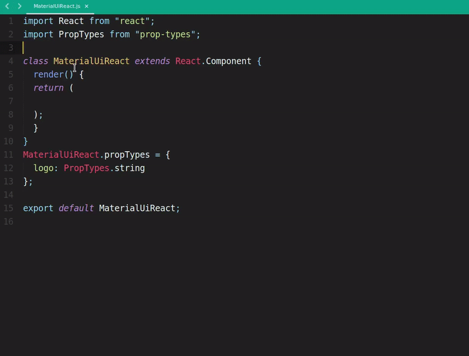
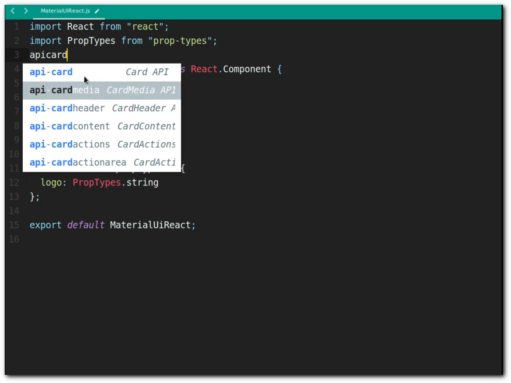
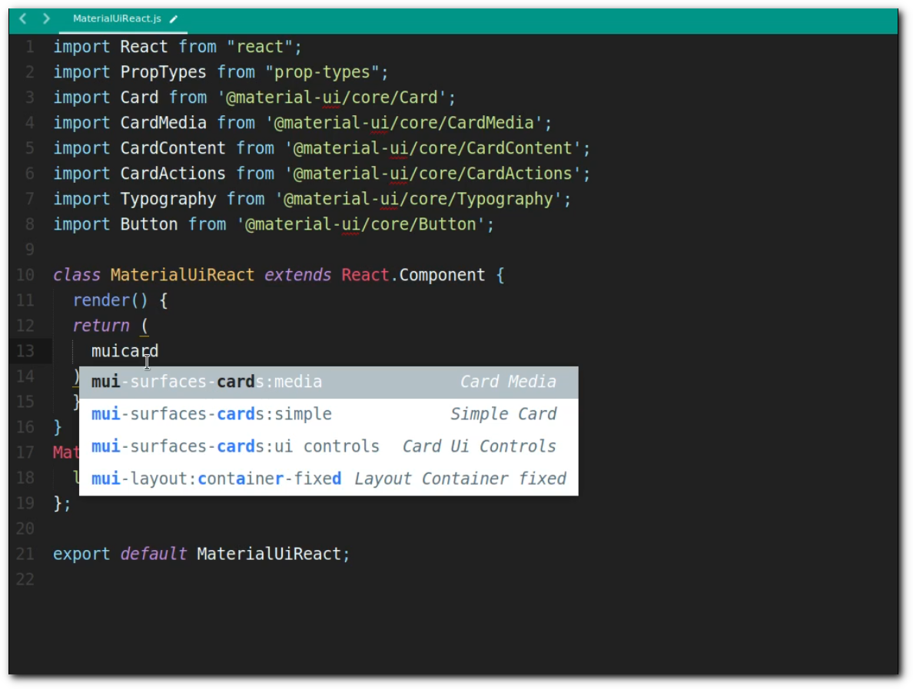
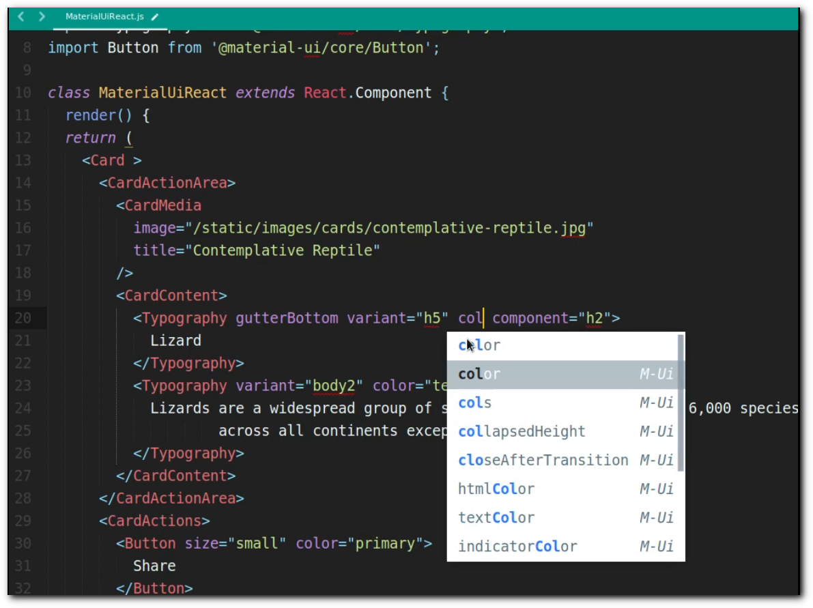
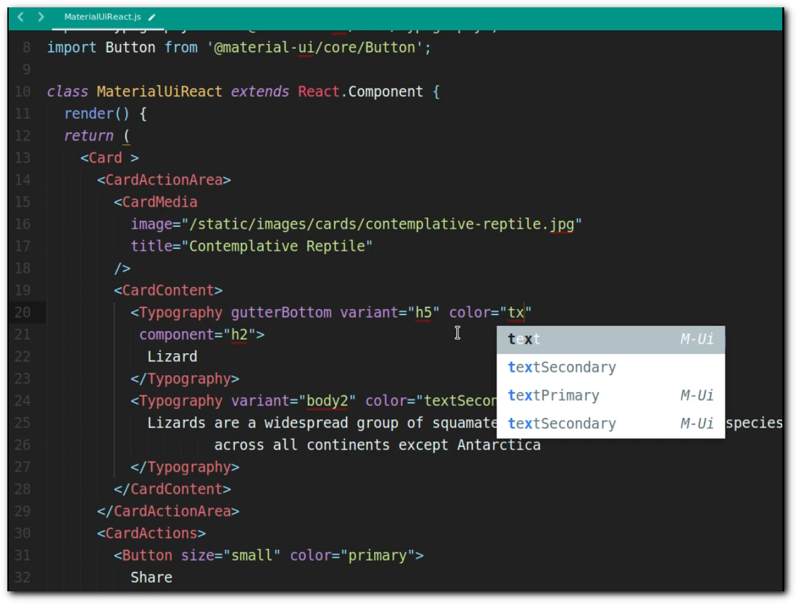

MaterialUi-React-Component Snippet-Autocomplete [](https://github.com/Pushpamk/MaterialUi-React-Component-Snippet-Autocomplete/releases)
=============

### MaterialUi-React-Component Snippet-Autocomplete Sublime Plugin

Auto-complete plugin for MaterialUi Component props .

### Installation

With [Package Control](http://wbond.net/sublime_packages/package_control):

1. Run “Package Control: Install Package” command, find and install `Emmet` plugin.
2. Restart ST editor (if required)

Manually:

You can clone this repository to the Packages directory of your Sublime installation.

```bash
git clone https://github.com/Pushpamk/MaterialUi-React-Component-Snippet-Autocomplete.git
```
### Configuration

Go to *Preference > Setting* add `"auto_complete_selector": true`  

Or  

Go to *Preference > Setting* add `"auto_complete_triggers": [{"selector": "source.js", "characters": "mui"},{"selector": "source.js", "characters": "api"}]`

### MaterialUi

MaterialUi is a React components for faster and easier web development. Build your own design system, or start with Material Design.

* Homepage: [https://material-ui.com/](https://material-ui.com/)

### Usage

  

#### Import MaterialUi Packages



#### MaterialUi React Component Snippet 

 

more info: [Components](https://material-ui.com/getting-started/installation/)

**Props name and value autocompletion**: When inside components tag (`<CardMedia [HERE] />`) and (`variant="[HERE]"`), suggestions will appear.

 



**Note**: In order for the suggestions to appear, your document needs to have the syntax set to `JS`. You can set the syntax from the menu *View > Syntax* or via the Command Palette.

To make a new version of the plugin available via package control, a new version tag needs to be created.

## Copyright and license

Licensed under the [MIT License](LICENSE)